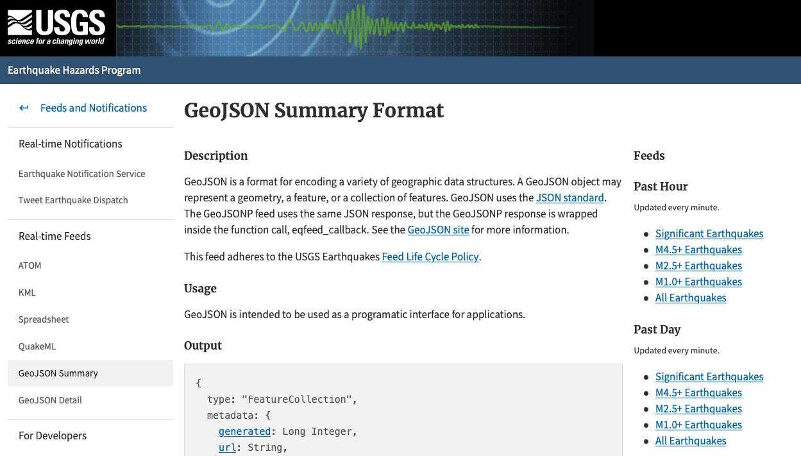
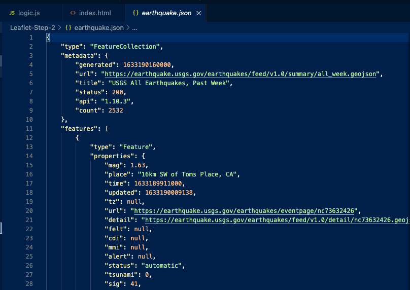
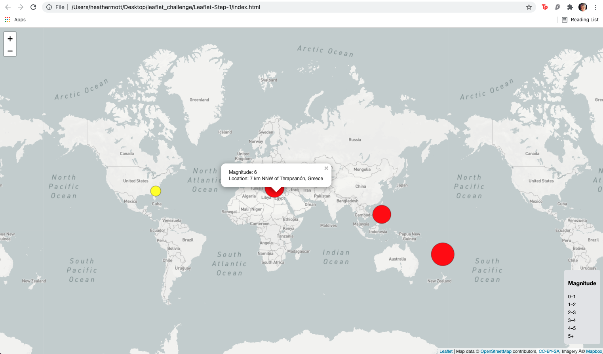

# Visualizing Data with Leaflet

## Background

The objective of this challenge was to utilize `html` and `JavaScript` to visualize recent earthquake data from around the world.

### Basic Visualization

1. Data set obtained from [USGS](https://earthquake.usgs.gov/earthquakes/feed/v1.0/geojson.php)

2. Save the data in a `JSON` file

3. Create a map using Leaflet plots of the earthquake data based on their longitude and latitude.  The map should include a legend and popups.

